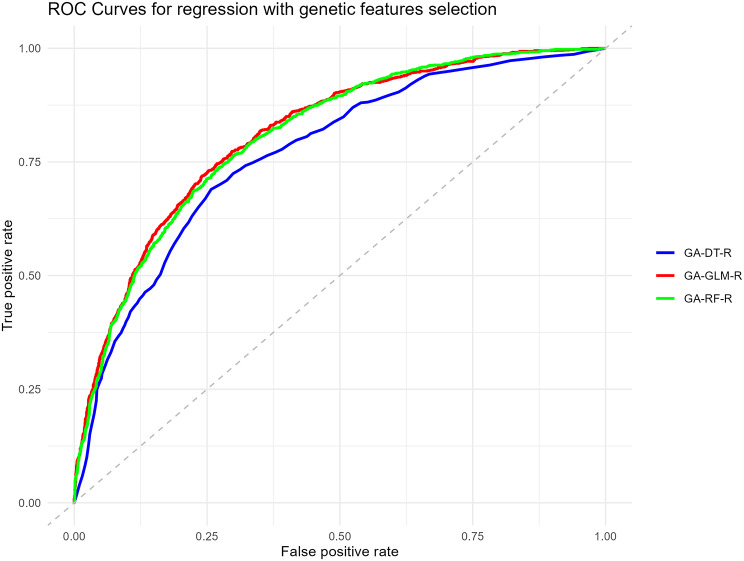
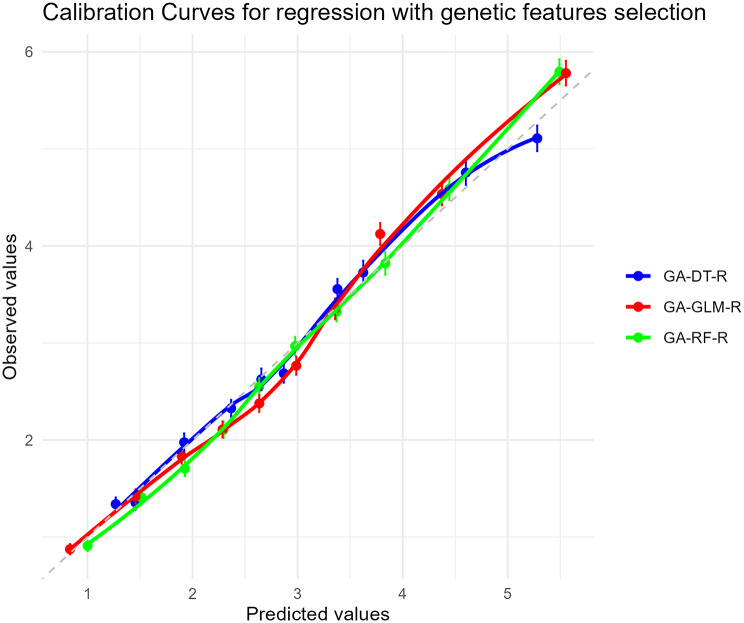
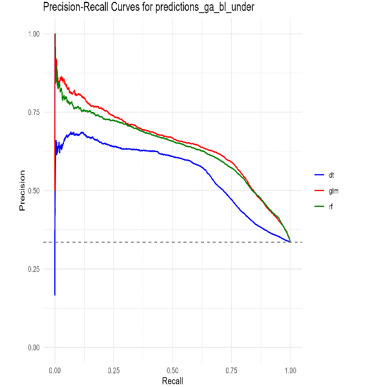

# BMC2025: Depression Risk Prediction from Longitudinal Clinical Data

## Overview

**TL;DR**
- This repository contains an R-based predictive modeling workflow for long-term depression risk estimation (`euro_d`) from longitudinal clinical data.
- Project framing targets a 2-year prediction horizon in a clinical follow-up setting.
- Models compared in code: Decision Tree (`rpart`), Random Forest (`rf`), and Generalized Linear Model (`glm`).
- Feature selection strategies implemented: random forward selection, random backward selection, and genetic algorithms.
- Validation includes k-fold cross-validation and repeated double cross-validation (`double_cv` in `cv.R`), with threshold analysis.
- Data artifacts in this repo include high-dimensional longitudinal tables up to `42669 x 283` (`data/not_onco_combined_dataset.sav`), while the primary modeling dataset used in the notebook pipeline is `4057 x 89` (`data/dataset.sav`).
- Key screening-oriented metrics (reported in the associated study context): **AUC 0.81**, **Sensitivity 90.7%**, **Specificity 43.8%**.

## Model Performance



*ROC curve comparing model discrimination performance (GA-selected feature setting).*



*Calibration curve showing agreement between predicted and observed outcomes.*



*Precision-Recall curve highlighting performance under class imbalance.*

## Methodology

- **Supervised learning task:** binary depression-risk prediction on target variable `euro_d`.
- **Longitudinal clinical data:** wave-based variables processed and harmonized across follow-up.
- **Feature selection:** random forward selection (`fwfs.R`), random backward selection (`bwfs.R`), and genetic feature selection (`genetic.R`).
- **Validation design:** k-fold cross-validation plus repeated double cross-validation (`double_cv`, configurable under/over-sampling).
- **Model comparison:** Decision Tree (`rpart`), Random Forest (`rf`), and GLM (`glm`) with threshold-dependent operating-point analysis.

## Clinical Use Case

The intended use is early risk screening for depression in clinical populations (including oncology-focused cohorts in this codebase).  
Given a screening objective, sensitivity is prioritized to reduce false negatives and support earlier follow-up evaluation, while accepting lower specificity as a triage tradeoff.

## Repository Structure

- `data/`: input SPSS datasets (`dataset.sav`, `score_dataset.sav`, `not_onco_combined_dataset.sav`).
- `scripts/`: setup and environment validation (`setup_environment.R`, `check_environment.R`).
- `notebooks/`: exploratory and reporting workflows (`analisi_base.ipynb`, `analisi_base.qmd`).
- `results/`: exported model-performance figures (ROC, calibration, PR).
- `predictions/`: saved out-of-fold prediction outputs across balancing/selection strategies.
- `thresholds/`: threshold-level sensitivity/specificity/PPV/NPV summaries.
- Root R scripts (`pipeline.R`, `cv.R`, `fwfs.R`, `bwfs.R`, `genetic.R`, `ddop_*.R`): core modeling and utility pipeline.

## How to Run

Minimal local workflow from repository root:

```powershell
Rscript scripts/setup_environment.R --register-kernel
Rscript scripts/check_environment.R
python -m jupyter lab
quarto render notebooks/analisi_base.qmd
```

Then open:
- `notebooks/analisi_base.ipynb` (R kernel), or
- `notebooks/analisi_base.html` after Quarto rendering.

To execute the full pipeline programmatically, use `pipeline.R` (entry function `rpm()`).

If command details need adjustment for your environment, use repository entry points (`scripts/`, `notebooks/`, and `pipeline.R`) as the source of truth rather than generic external commands.

Online options already used in this project context:
- Posit Cloud: upload the project folder and render `notebooks/analisi_base.qmd`.
- GitHub Codespaces: clone the repository and run the same commands.

## Reference

Belvederi Murri M, Sciavicco G, Specchia M, et al. [Risk prediction models for depression in older adults with cancer](https://bmcpsychiatry.biomedcentral.com/articles/10.1186/s12888-025-07578-6). **BMC Psychiatry**. 2025.


